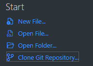
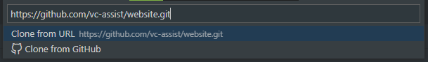
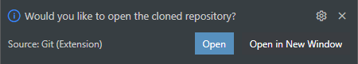
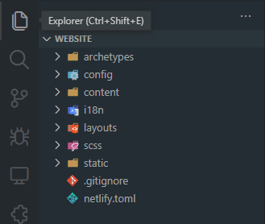
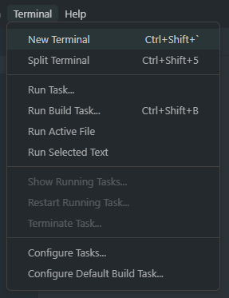
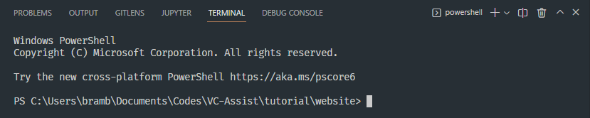
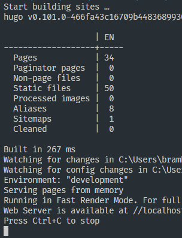
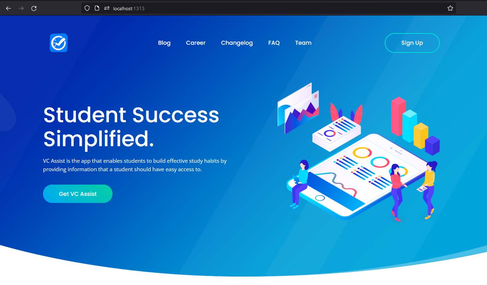

# website

[Demo Website](https://amazing-fudge-577b2a.netlify.app/)

Uses Agico Hugo Theme

## editing (for marketing personnel)

### prerequisites

- download [git](https://git-scm.com/)
- download [vscode](https://code.visualstudio.com/)
- install [hugo](https://gohugo.io/getting-started/installing/), this may be a bit difficult, do not hesitate to reach out if you get stuck

### setup

1. open vscode and click on `Clone Git Repository...`, then paste [this link](https://github.com/vc-assist/website.git) into the box and select `Clone from URL`
    - 
    - 
1. when the popup in the bottom right appears, click `open` when all the progress bars finish
    - 
1. if you press the file looking icon at the top left, you should see a few folders and files
    - 
1. press `ctrl` + `` ` `` or click menu item `Terminal>New terminal` this should make a command window pop up
    - 
    - 
1. in the terminal window, type `hugo server` and press enter. you should see an output that looks like this
    - 
1. if you go to `http://localhost:1313` in your browser now, it should show the website preview
    - 

### learn syntax

- learn about `.md` files or markdown [here](https://www.markdownguide.org/cheat-sheet/)
- learn about `.toml` files [here](https://quickref.me/toml)

### where to find things to edit

you can find more detailed documentation [here](https://docs.gethugothemes.com/agico/basic-configuration/)

- [config/](./config/) - global configuration files
    - [config.toml](./config/_default/config.toml) - you probably won't need to use this
    - [menus.en.toml](./config/_default/menus.en.toml) - edit this if you want to change the entries on the menu at the top
    - [params.toml](./config/_default/params.toml) - other miscellaneous configuration including
        - the sign up button
        - website metadata that may show up on google search
        - contact info
        - etc...
- [content/](./content/) - website content
    - [_index.md](./content/_index.md) - the home page
    - [team.md](./content/team.md) - the "Team" page
    - [changelog.md](./content/changelog.md) - the "Changelog" page
    - [faq.md](./content/faq.md) - the "FAQ" page
    - [blog/](./content/blog/) - blog content
        - [_index.md](./content/blog/_index.md) - metadata
        - `blog.X.md` - the blog pages, to add a new blog just add a new file with name `blog.X+1.md`
    - [career/](./content/career/) - hiring page
        - [_index.md](./content/career/_index.md) - metadata
        - `position.X.md` - an open position and their roles and such, to add a new open position just add a new file with name `position.X+1.md`
- [static/images/](./static/images) - images, you can browse the subfolders and see what they're all about
